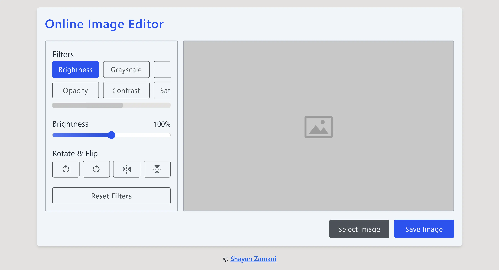

<h1>Online Image Editor</h1>

<blockquote>
   <p>
      Easily edit your images in just a few clicks.
   </p>
</blockquote>

<figure>
   
</figure>

<h2>Overview</h2>
<h3>Features:</h3>
<ul>
   <li>Responsive and compatible with various device types and browsers</li>
   <li>Image upload by drag & drop or using the prompt window</li>
   <li>Image flip and rotation</li>
   <li>Filters such as brightness, grayscale, blur, hue-rotation, opacity, contrast, saturation, and sepia</li>
   <li>Reset all edits at once</li>
   <li>Download the edited image</li>
</ul>

<h3>Built with:</h3>
<ul>
   <li>Semantic HTML</li>
   <li>Modern Vanilla CSS transpiled with <a href="https://lightningcss.dev">Lightning CSS</a></li>
   <li>
      <a href="https://www.typescriptlang.org">TypeScript</a>
   </li>
   <li>
      <a href="https://astro.build">Astro</a> - JavaScript Framework
   </li>
</ul>

<h3>Tested with:</h3>
<ul>
   <li>
      <a href="https://vitest.dev">Vitest</a>
   </li>
   <li>
      <a href="https://cypress.io">Cypress</a>
   </li>
</ul>

<h3>Links</h3>
<ul>
   <li>
      <a href="https://shayanthenerd.github.io/image-editor">Project homepage</a>
   </li>
   <li>
      <a href="https://github.com/ShayanTheNerd?tab=repositories">Other projects</a>
   </li>
</ul>

<h2>Development setup</h2>
<p>1. Clone the project:</p>

```sh
git clone https://github.com/ShayanTheNerd/image-editor.git
```

<p>2. Install dependencies:</p>

```sh
pnpm install
```

<p>3. Run the <code>dev</code> script to start the dev server:</p>

```sh
pnpm run dev
```

<p>4. Visit <a href="http://127.0.0.1:3000/image-editor">http://127.0.0.1:3000/image-editor</a>.</p>

<h2>Style Guide</h2>
<p>If you want to develop this project, please adhere to these guidelines:</p>
<ul>
   <li>Add Git commit messages according to <a href="https://conventional-emoji-commits.site/quick-summary/summary">Conventional Commits Specification</a>.</li>
   <li>Follow the current architecture, coding paradigm, and project folder structure.</li>
   <li>Follow the current character case principles for ids, classes, variables, file and folder names, etc.</li>
   <li>Add the necessary unit/e2e tests first, then write the appropriate code, and make sure all tests pass.</li>
</ul>

<h2>Contribution</h2>
<p>Your contribution is always welcome, please follow these steps:</p>
<ol>
   <li>
      <a href="https://github.com/ShayanTheNerd/image-editor/fork">Fork the project</a>.
   </li>
   <li>Create your feature branch: <code>git checkout -b feature/branch-name</code>.</li>
   <li>Make sure to follow instructions in the <a href="https://github.com/ShayanTheNerd/image-editor?tab=readme-ov-file#style-guide">style guide</a> section.</li>
   <li>Stage all changes you made: <code>git add -A</code>.</li>
   <li>Commit all staged changes with a descriptive commit message: <code>git commit -m '✨ feat: add foo bar baz'</code>. Note that the commit fails if any of the format, lint, or test scripts run in the pre-commit Git hook fail.</li>
   <li>Push everything to the feature branch: <code>git push origin feature/branch-name</code>.</li>
   <li>Create a Pull Request.</li>
</ol>

<h2>License</h2>
<p>
   This project is licensed under <a href="https://github.com/ShayanTheNerd/image-editor/blob/main/LICENSE.md">BSD 3 Clause License</a>. Created by <a href="https://shayan-zamani.me">Shayan Zamani</a>.
</p>
